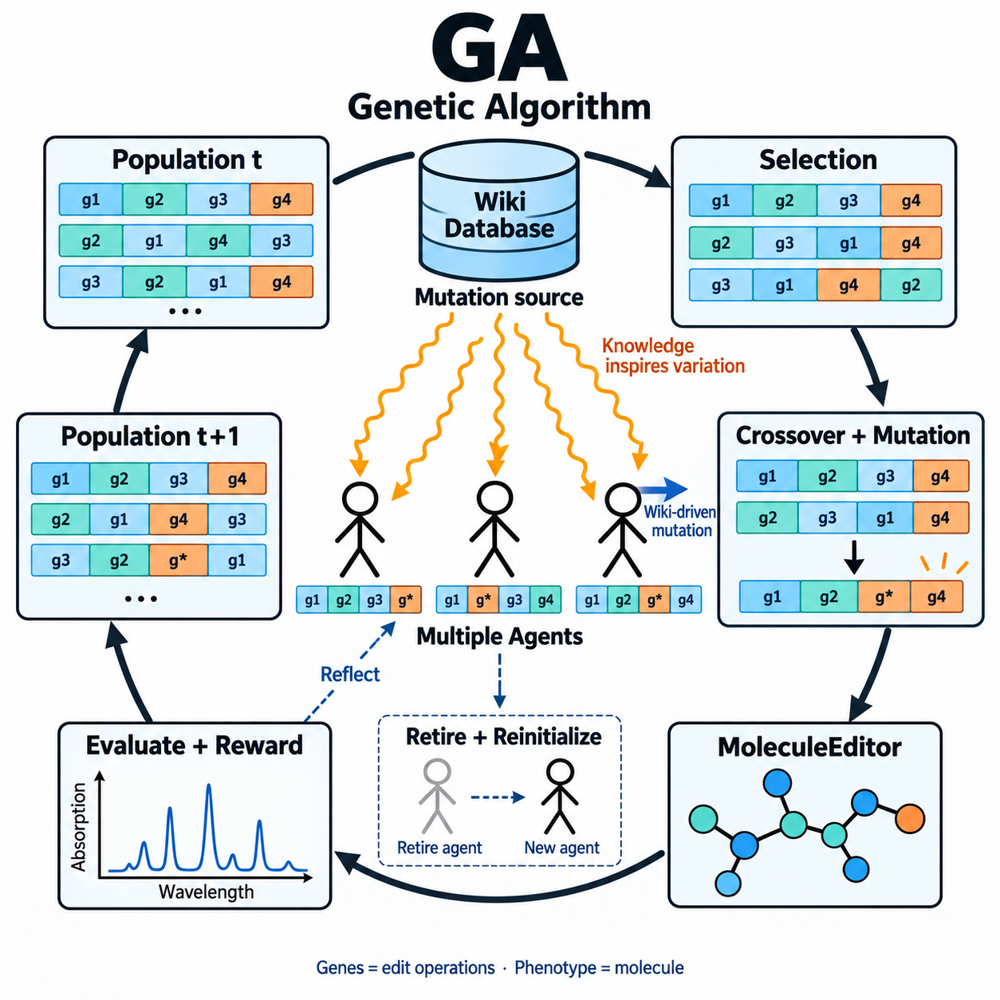
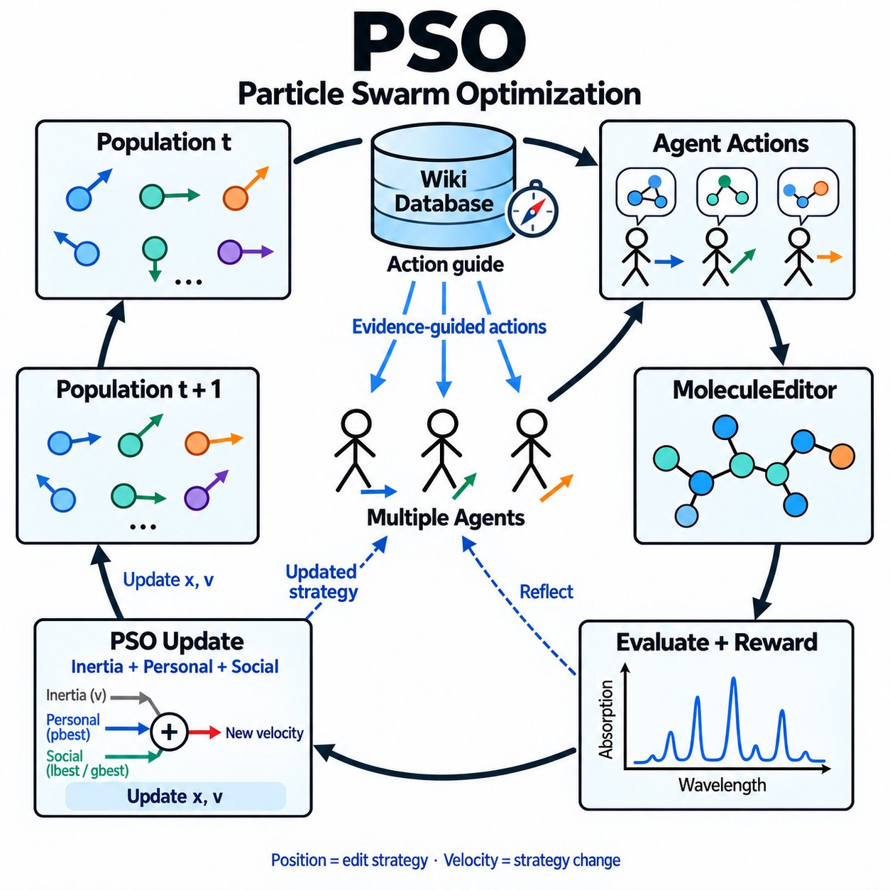

# Multi-agent algorithm schematics

Two matched square concept figures, 1254 × 1254 pixels each. Stick figures represent
agents; the outer loops represent optimizer-controlled population updates.

| Genetic algorithm | Particle swarm optimization |
|---|---|
|  |  |

- **GA:** the Wiki database emits orange knowledge signals that inspire mutations
  across multiple agents. Selection, crossover, validated editing, and external
  rewards determine the next population. The radiation motif is a visual metaphor
  for knowledge influence, not physical irradiation.
- **PSO:** the Wiki database provides blue directional guidance for agent actions.
  Personal and social bests, together with inertia, inform strategy updates and
  the transition to the next population.

Molecular graphs, spectra, and population arrangements are illustrative, not measured
results. Generated with the built-in image-generation tool; its exact model version
was not exposed, so these files are not attributed to a verified model version.
